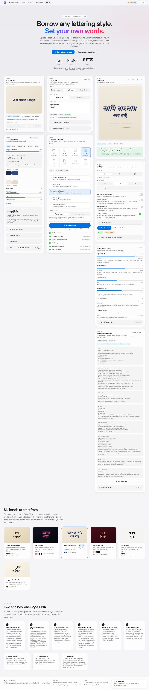
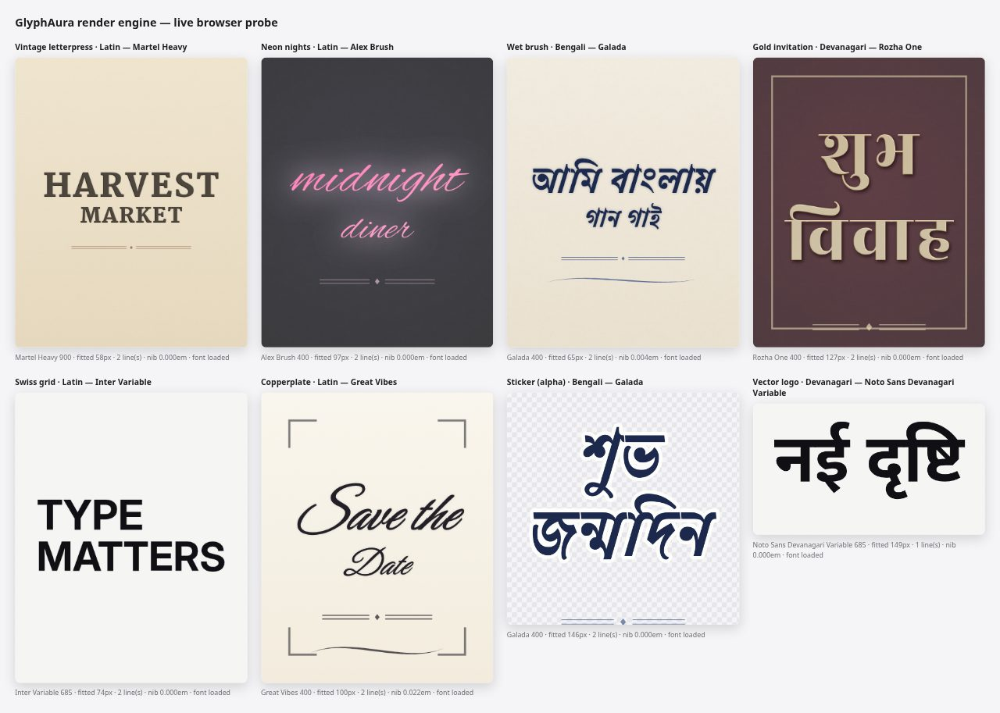
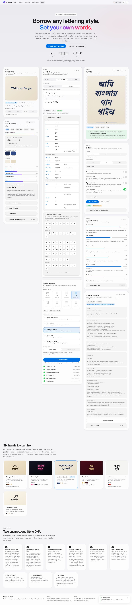
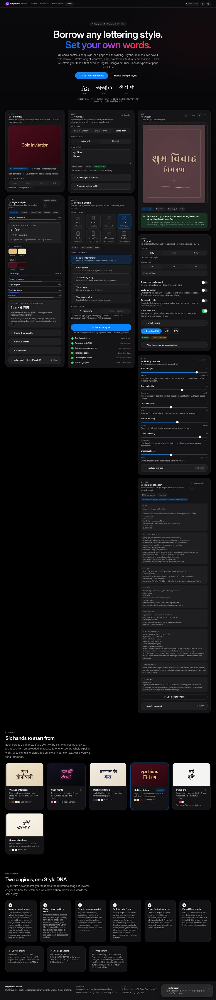
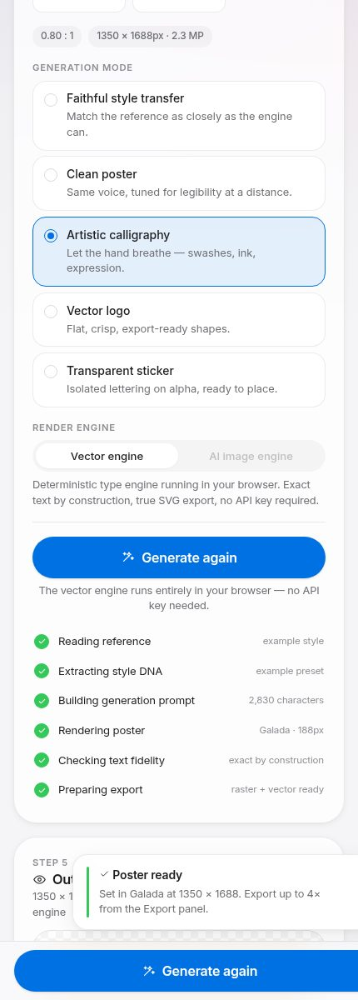

# GlyphAura Studio

**Multilingual typography and calligraphy style transfer for English, Bengali and Hindi.**

Upload a reference image containing lettering — a poster, a shop sign, a page of
handwriting. GlyphAura measures *how it was drawn* (stroke weight, thick/thin
contrast, slant, palette, ink behaviour, texture, composition), writes that down
as a structured **Style DNA** object, and then re-letters **your** text in the same
hand. Output is a high-resolution poster, exportable as PNG, JPG or SVG.

It never pastes your words onto the reference image, and it never changes your text.



<sub>Captured from a real headless Chromium run: Bengali text set in Galada, the Style DNA panel
populated from the reference, and the export panel unlocked. More below.</sub>

---

## Two engines, one Style DNA

| | Vector engine *(default)* | AI image engine |
|---|---|---|
| Runs | In your browser | Gemini, server-side |
| API key | Not needed | Required |
| Text fidelity | **Exact by construction** — your string is set with a real font and the browser's shaping engine | Verified afterwards by an OCR round-trip, with a stricter regeneration path if it drifted |
| Output | Raster at any resolution + true SVG with live text | Raster bitmap |
| Best for | Reliable characters, print resolution, editable vector, Indic scripts | Painterly texture a type engine cannot fake |

Both engines consume the same Style DNA, the same six fidelity sliders and the same
five generation modes, so switching between them keeps your intent.

The studio is **fully functional with no API key at all**: the reference is measured
in-browser and the vector engine renders locally. A key upgrades three things —
the Gemini analyst (which also *reads* the reference text), OCR verification, and
raster generation.

---

## Run it without a terminal

The vector engine, the analyser and the phonetic keyboards all run in the browser,
so the studio is fully usable as a static site — no install, no command line.

**Live build:** every push to `main` is tested, built and published to GitHub Pages by
`.github/workflows/deploy.yml`. Open the Pages URL for this repository and start working.

What the hosted build cannot do, because it has no server: Gemini style analysis,
AI raster generation, OCR verification and Gemini-assisted transliteration. Those need
the Node server in this repo and an API key. Everything else — reference measurement,
style DNA, rendering, all six fidelity sliders, PNG/JPG/SVG export at up to 4× — works.

## Quick start

```bash
npm install
npm run fonts:fetch     # vendors 32 OFL faces into public/fonts (~11.3 MB, once)
npm run dev             # API server on :8787 + Vite on :5173
```

Open <http://localhost:5173>.

To enable the Gemini features:

```bash
cp .env.example .env
# add GEMINI_API_KEY=...   (from https://aistudio.google.com/apikey)
```

The key is read **only** by the Node server and is never sent to the browser. The
UI asks the server what it can do (`GET /api/health`) and disables exactly the
controls that are not available — nothing in the interface pretends to work.

### Production

```bash
npm run build           # type-check + Vite bundle into dist/
npm start               # single Node process serves dist/ and /api
```

---

## The workflow

1. **Reference** — drag in a JPG, PNG or WEBP (≤ 12 MB), or load one of six bundled
   example styles. File name, pixel dimensions and size are shown; the script can be
   forced by hand if the detector guesses wrong.
2. **Style analysis** — the Style DNA appears as swatches, meters and profile tables,
   with an *Advanced* view of the raw JSON. Every number is a measurement, not a vibe.
3. **Your text** — pick English, Bengali or Hindi. Indic languages get a phonetic
   keyboard (type `bhalo`, get ভালো), a printed guide, and a character palette for
   kar signs and conjuncts. The converted text stays editable.
4. **Format & engine** — aspect ratio (16:9, 9:16, 1:1, 4:5, 3:4, A4 portrait, A4
   landscape, custom), generation mode, engine. Then **Generate**, with six visible
   progress stages.
5. **Output** — zoomable preview, a text-fidelity verdict, and any notes the renderer
   wants you to know.
6. **Export** — PNG / JPG / SVG at 1×, 2× or 4×; transparent background; typography
   only; preserve effects; embed the font in the SVG.

Fidelity sliders (**style strength, text readability, ornamentation, texture
intensity, colour matching, brush roughness**) re-render the vector poster live.

---

## What the analyser actually measures

Nothing here is a placeholder. `src/lib/analysis/` implements:

- **Segmentation** — Otsu's method over an illumination-flattened field (a wide box
  blur is subtracted first), so lettering on a gradient or vignetted poster still
  separates cleanly. Ink polarity is decided by which class hugs the frame.
- **Stroke geometry** — median horizontal/vertical run length gives stroke width;
  the p15–p85 spread gives thick/thin contrast.
- **Edge quality** — measured perimeter against the perimeter a smooth stroke of that
  width would have, which is how "dry brush" gets a number.
- **Slant** — a shear search that maximises the spikiness of the vertical projection
  profile; stems line up at the true angle.
- **Palette** — k-means with deterministic farthest-point seeding, so the same image
  always yields the same swatches.
- **Composition** — line boxes from the horizontal projection, alignment from the
  variance of line edges, hierarchy from clustering line heights, margins from the
  bounding box.
- **Effects** — glow from how far the near-ink background is pulled towards the ink
  colour; shadow from the offset centroid of intermediate-tone pixels; grain from
  high-frequency energy in the background only.
- **Script hint** — a sharp density spike in the top third of a line flags the
  Bengali matra / Devanagari shirorekha, distinguishing Indic from Latin references.

## What the render engine actually does

`src/lib/render/` builds the poster in the order a lettering artist works: ground,
ornament, shadow, glow, ink bleed, outline, ink, then surface treatments.

- **Typeface matching** — every bundled face is scored against the Style DNA (shape
  family, contrast band, weight coverage, descriptive tags, caps-only suitability)
  for the target script. You can override the winner by hand.
- **Broad-nib modulation** — where the reference has more thick/thin contrast than the
  chosen face, the outline is swept along the pen angle (a Minkowski sum with a line
  segment) — which is precisely what a broad-nib pen does. Contrast without faking it.
- **Real effects** — variable-weight axes, shear for slant, linear/radial gradients,
  outline, offset shadow, additive glow, inner bevel emboss, ink bleed, seeded
  dry-brush erosion of the glyph alpha, ink speckle, paper tooth, film grain,
  vignette — all sized in *em* units so 1× preview and 4× export are the same artwork.
- **Ornament** — swashes, rules with lozenges, corner brackets and inset frames,
  generated as tapered fillable outlines shared by both the canvas and SVG renderers.
- **Layout** — text is fitted by binary search, breaking lines only when that lets the
  type grow, and never splitting a word or an Indic cluster.

Raster exports are **re-rendered at the target resolution**, never upscaled.

---

## Phonetic input

A rule engine plus a curated lexicon, with optional Gemini refinement.

| | Bengali | Hindi |
|---|---|---|
| Aspirates | `kh gh ch jh th dh ph bh` | same |
| Retroflex | capitals: `T Th D Dh N` | same |
| Inherent vowel | `o` inside a word (`kolom` → কলম), ও-kar at the end (`bhalo` → ভালো) | `a` (`namaste` → नमस्ते) |
| Nasals | `ng` / `M` → ং | `n` before a stop → ं (`mandir` → मंदिर) |
| Escapes | `/` forces hasanta · `~` candrabindu · `'` splits a digraph · `|` daṇḍa | same, halant |

All eight worked examples from the brief are covered by tests:
`ami`→আমি, `tumi`→তুমি, `bhalo`→ভালো, `bangla`→বাংলা,
`namaste`→नमस्ते, `bharat`→भारत, `pyaar`→प्यार, `shanti`→शांति.

Title case and SHOUTING are folded down before conversion (so `Tumi` is তুমি, not
টুমি) while deliberate mid-word capitals are preserved (`poTol` → পটল).

---

## Text fidelity

Image models mangle lettering, and in Bengali and Devanagari a displaced matra
changes the word. Two mechanisms address this:

- The **vector engine** sets your exact string with a real font, so drift is
  structurally impossible. The report says *guaranteed*.
- The **AI engine** sends a hard guard rail with the string delimited by `<<< >>>`,
  then reads the poster back with OCR and compares (NFC-normalised, zero-width
  characters ignored, Levenshtein similarity). Below 98.5% you get a warning and a
  **Regenerate with stricter text fidelity** button that escalates the prompt.

---

## Project layout

```
server/                 zero-dependency Node API (node:http) — Gemini proxy + static host
  lib/gemini.mjs         structured-output calls, retries, both image model families
  lib/schema.mjs         Style DNA response schema for Gemini structured output
  lib/prompts.mjs        analyst / OCR / transliteration system prompts
src/
  types/                 StyleDna + RenderHints, project domain types
  lib/analysis/          pixel measurement → Style DNA (works offline)
  lib/script/            script detection, transliteration tables, lexicons
  lib/render/            font selection, params, layout, effects, ornament, canvas, SVG
  lib/export/            encoders, filenames, background removal
  lib/prompt/            prompt assembly (the same text the inspector shows)
  lib/verify/            OCR comparison
  state/                 reducer store + pipeline hooks
  components/            the studio UI
  styles/                design tokens and component CSS
scripts/font-manifest.mjs  the bundled type library, described once
scripts/fetch-fonts.mjs    vendors it from google/fonts, writes fonts.css + manifest
tests/                     node:test suites, no test framework to install
tools/offline-typecheck/   type-check without node_modules (see its README)
```

## Scripts

| Command | Does |
|---|---|
| `npm run dev` | API + Vite together |
| `npm run build` | Type-check, then bundle |
| `npm start` | Serve `dist/` and `/api` from one Node process |
| `npm test` | 72 test cases across transliteration, analysis, layout, params, prompt, fidelity and SVG |
| `npm run typecheck` | `tsc --noEmit` |
| `npm run fonts:fetch` | Vendor the type library (skips faces already present) |

`npm test` uses Node's built-in runner with `--experimental-strip-types`, so the
suite runs with **zero devDependencies installed** (Node ≥ 22.6).

---

## API

All Gemini traffic goes through the server. Every endpoint degrades with a clear
`code` the UI can act on.

| Endpoint | Purpose |
|---|---|
| `GET /api/health` | Capability report the UI uses to enable/disable controls |
| `POST /api/analyze` | Reference image → Style DNA (structured output) |
| `POST /api/generate-image` | Prompt → poster bitmap (`gemini-*-image` or Imagen) |
| `POST /api/ocr` | Poster → transcription for the fidelity check |
| `POST /api/transliterate` | Romanised text → Bengali/Devanagari refinement |

---

## Fonts and licensing

32 faces are bundled under the **SIL Open Font License 1.1**, vendored from
[google/fonts](https://github.com/google/fonts) by `npm run fonts:fetch`. Per-family
licence texts land in `public/fonts/licenses/`. Coverage: 15 Latin, 8 Bengali and
9 Devanagari faces across serif, sans, slab, display, script, brush, handwriting,
rounded and blackletter.

Posters you generate are yours. Check the licence of any reference image you upload —
the studio only reads its style, but the artwork itself may belong to someone else.

## Known limits

- The vector engine matches the closest bundled typeface and modulates it; it does not
  synthesise new glyph outlines from the reference photograph. Outline synthesis is a
  research problem, not a slider.
- SVG export writes live text plus SVG filters. Pixel-level dry brush and ink speckle
  are approximated there, and the inner bevel is raster-only; the file lists every
  approximation it made. True contour tracing is on the roadmap.
- Local script detection can tell "Indic" from "Latin" but not Bengali from Devanagari.
  Set it by hand, or add an API key and let the analyst read it.
- `npm run fonts:fetch` needs network access to GitHub once. After that the studio is
  entirely offline.
- Verified in headless Chromium only (see below). Safari and Firefox should be fine —
  the two features with patchy support, `ctx.letterSpacing` and canvas `filter`, both
  have fallbacks — but they have not been exercised on real hardware.

## Verified in a browser

The interface and the render engine were driven in headless Chromium over the DevTools
protocol, with the console relayed so a thrown error could not hide behind a screenshot.
Every run below reported **zero console errors and zero uncaught exceptions**.

| What was checked | Result |
|---|---|
| App mounts, all panels render, empty states correct | ✅ |
| Load example → Generate → all six stages complete | ✅ poster in 0.5 s |
| Phonetic keyboard, live | `ami banglay gan gai` → আমি বাংলায় গান গাই |
| Character palette insert | appends the glyph, poster re-renders with it |
| Text fidelity verdict | *exact by construction*, alt text carries the real string |
| PNG export at 2× | 2700 × 3376, RGBA — a true re-render, not an upscale |
| SVG export | valid XML, live `<text>`, embedded font, filters present |
| Dark mode, mobile (430 px) | ✅ single column, sticky Generate bar |

Five real bugs were found this way and fixed: an effect description reading
`"none — flat colour"` was not recognised as *none* (so flat artwork rendered with a
gradient); explicit numeric render hints were being overridden by prose parsing; the
line-breaking fitter re-flowed line breaks the designer had typed; a duplicate render
fired straight after the first generate; and Indic vowel signs were stripped from export
filenames because they are Unicode *marks*, not letters.

| | |
|---|---|
|  |  |
| Eight presets across three scripts, straight from the engine | The phonetic keyboard, guide and character palette |
|  |  |
| Dark appearance, Devanagari poster | 430 px, stacked panels, sticky Generate |
